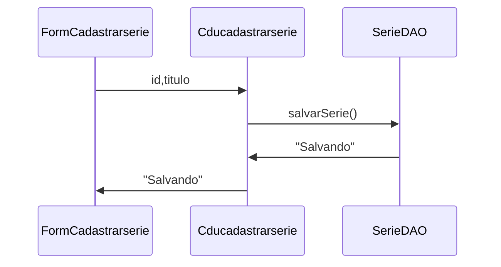
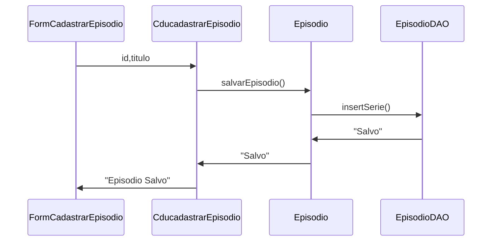

1. Caso de uso `Cadastrar Série`:

```mermaid
sequenceDiagram
    FormCadastrarserie->>Cducadastrarserie: id,titulo
    Cducadastrarserie->>SerieDAO: salvarSerie()
    SerieDAO->>Cducadastrarserie: "Salvando"
    Cducadastrarserie->>FormCadastrarserie: "Salvando"
```

2. Caso de uso `Cadastrar Episodio`:

```mermaid
sequenceDiagram
    FormCadastrarEpisodio->>CducadastrarEpisodio: id,titulo
    CducadastrarEpisodio->>Episodio: salvarEpisodio()
    Episodio->>EpisodioDAO: insertSerie()
    EpisodioDAO->>Episodio: "Salvo"
    Episodio->>CducadastrarEpisodio: "Salvo"
    CducadastrarEpisodio->>FormCadastrarEpisodio: "Episodio Salvo"
```

3. Caso de uso `Cadastrar Ator`:
...
4. Caso de uso `Cadastrar Personagem`:
5. Caso de uso `Cadastrar Performance`:
