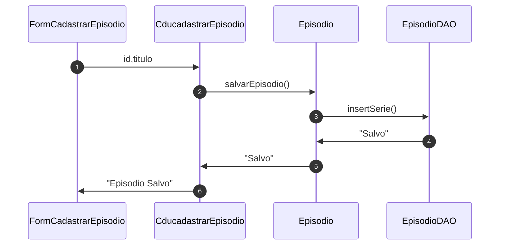

1. Caso de uso `Cadastrar Série`:

2. Caso de uso `Cadastrar Episodio`:

]
3. Caso de uso `Cadastrar Ator`:
<!-- ToDo  -->
4. Caso de uso `Cadastrar Personagem`:
<!-- ToDo  -->
5. Caso de uso `Cadastrar Performance`:
<!-- ToDo  -->
