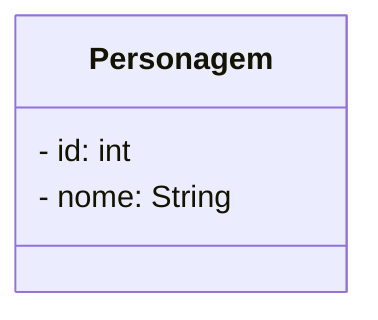

# Programação Orientada a Objetos com Java </img>

Atividades e exercícios da disciplina de POO

</img>

Ifes Campus Serra

@Jramso - `Josué Ramos Souza` - 4ºPeríodo

    
<strong style="font-size:1.5rem; color:LightSkyBlue;">Lista 1</strong>
    

- [1: Ponto2D:Ponto no Plano](Ponto2D) 📍
- [2: Eq2g:Equação de segundo grau](Eq2g) :straight_ruler:
- [3: Retangulo:Cria um retangulo](Retangulo) :black_square_button:
- [4: Automovel: Cria um automovel](Automovel) :oncoming_automobile:

    
<strong style="font-size:1.5rem; color: Turquoise;">Lista 2</strong>

- [5: Figuras: Cria um conjunto de figuras 2D (Circulos, Triangulos e Retangulo)](Figuras)
- [6: Eletronics: Cria um conjunto de eletronicos (Smartphone, Tel fixo, Fone de ouvido, Cx. de som)](Eletronics)

    
<strong style="font-size:1.5rem; color: Aqua;">Lista 3</strong>

- [7: Spootify: Cria um modelo semelhante a um Spotify (Musicas,podcasts e audiolivros)](Spootify)

## Revisao Prova 1:
- [8: Veiclinha: Cria um veiculo férreo, vagoes e locomotivas](VeiLinha)

***

## Projeto CRUD

***

- [9: POOFlix: Cria um "modelo de Netflix"](POOflix)

- Diagrama de classe
